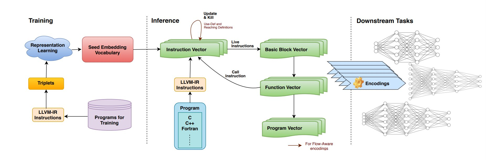
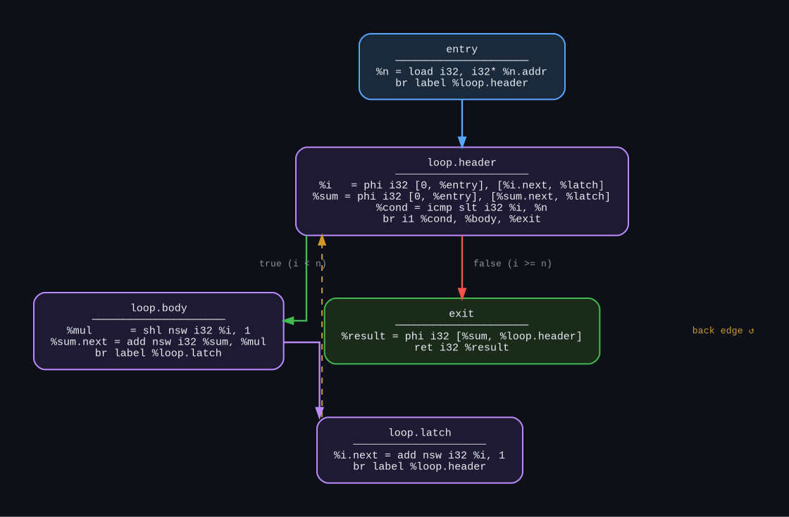
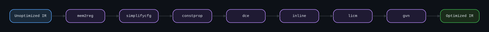

<div align="center">


&nbsp;&nbsp;&nbsp;&nbsp;


# 🔧 IRForge

### LLVM-Based Compiler Research · Internship Project

[](https://llvm.org/)
[](https://clang.llvm.org/)
[](https://github.com/IITH-Compilers/IR2Vec)
[](https://isocpp.org/)
[](https://cmake.org/)
[](LICENSE)

<br/>

> *Internship research project exploring LLVM infrastructure — from frontend parsing and IR generation*  
> *through optimization passes, IR2Vec embeddings, and native code emission.*

Covers **SSA transformation**, **control flow graphs**, **IR2Vec program representations**,  
and the full LLVM pass manager pipeline.

<br/>

```
Frontend  ──▶  IR Gen  ──▶  IR2Vec  ──▶  Optimizer  ──▶  Codegen
  AST            SSA        Embed         Passes         Native
```

</div>

---

## Prerequisites

> Requires **LLVM 15+**. Verify with `llvm-config --version` before building.

```bash
sudo apt update && sudo apt install llvm clang cmake ninja-build graphviz
```

---

## Build

```bash
# Configure
cmake -G Ninja -DCMAKE_BUILD_TYPE=Release -B build

# Compile
cmake --build build
```

---

## Usage

```bash
# Compile a source file
./compiler input.c -o output

# Emit LLVM IR (unoptimized)
./compiler input.c --emit-ir -o output.ll

# Emit LLVM IR (with O2)
./compiler input.c --emit-ir -O2 -o output.ll

# Emit assembly
./compiler input.c --emit-asm -o output.s
```

---

## IR2Vec — Program Embeddings

[**IR2Vec**](https://github.com/IITH-Compilers/IR2Vec) is an LLVM IR-based framework that generates **compact vector representations** of programs in an unsupervised manner, capturing intrinsic program characteristics for downstream ML tasks. Published in **ACM TACO** by researchers at IIT Hyderabad.

### Complete IR2Vec Pipeline

<div align="center">



*The full IR2Vec pipeline — from training a seed embedding vocabulary to generating program vectors for downstream ML tasks*

</div>

The pipeline operates in **three distinct phases**:

---

#### 🏋️ Phase 1 — Training

The training phase builds a **Seed Embedding Vocabulary** that maps every LLVM IR construct to a vector:

```
Programs for Training
        │
        ▼
  LLVM-IR Instructions  ◀──  compiled via clang
        │
        ▼
     Triplets           ──  (anchor, positive, negative) relation triples
        │                    extracted from use-def, type, and opcode info
        ▼
Representation Learning ──  trains embeddings via a neural model
        │
        ▼
Seed Embedding Vocabulary ──  final lookup table: opcode/type/operand → vector
```

> The vocabulary is trained **once** and reused across all programs — no per-program training needed.

---

#### 🔍 Phase 2 — Inference

Given any new program (C / C++ / Fortran), IR2Vec generates embeddings hierarchically:

```
Program Source (C / C++ / Fortran)
        │
        ▼  clang → LLVM IR
 LLVM-IR Instructions
        │
        ▼  lookup seed embeddings + propagate
  Instruction Vector  ◀──── Update & Kill loop
        │       ▲              (Use-Def chains +
        │       └──────────── Reaching Definitions)
        │   Call Instruction feedback
        │
        ├──▶  Basic Block Vector   (aggregate over instructions in a BB)
        │
        ├──▶  Function Vector      (aggregate over basic blocks)
        │
        └──▶  Program Vector       (aggregate over functions)
```

**Flow-Aware mode** additionally propagates information along data-flow edges using **reaching definitions** and **use-def chains**, making embeddings context-sensitive rather than purely local.

| Level | Built From | Captures |
|---|---|---|
| `Instruction Vector` | Seed vocab + data-flow propagation | Opcode, types, operands, live info |
| `Basic Block Vector` | Sum of instruction vectors in the BB | Straight-line execution semantics |
| `Function Vector` | Aggregated basic block vectors | Full function-level behaviour |
| `Program Vector` | Aggregated function vectors | Whole-program representation |

---

#### 🎯 Phase 3 — Downstream Tasks

The final **Encodings** (stacked function/program vectors) feed directly into ML models:

```
Program Vector / Function Encodings
        │
        ▼
  Neural Networks  ──▶  Pass ordering & selection
                   ──▶  Performance prediction
                   ──▶  Compiler heuristic learning
                   ──▶  Code similarity & clustering
                   ──▶  Auto-vectorization decisions
```

---

### Why IR2Vec?

| Capability | Description |
|---|---|
| 🧠 **Hierarchical Representation** | Instruction → Basic Block → Function → Program, all from one vocabulary |
| ⚡ **ML-Ready** | 300-dim vectors plug directly into any downstream neural model |
| 🔍 **Flow-Aware** | Reaching definitions and use-def chains capture data-flow context |
| 🎯 **Language Agnostic** | Works on any language that compiles to LLVM IR (C, C++, Fortran, Rust…) |
| 🚀 **No Per-Program Training** | Seed vocabulary trained once; inference is fast and unsupervised |

### Generating IR2Vec Embeddings

```bash
# Step 1 — emit LLVM IR
clang -O0 -emit-llvm -S input.c -o input.ll

# Step 2 — generate function-level embeddings (symbolic mode)
ir2vec -sym -o embeddings.txt input.ll

# Step 3 — generate with flow-aware propagation (richer, data-flow sensitive)
ir2vec -fa -o embeddings_fa.txt input.ll

# Step 4 — inspect embedding for a specific function
grep "^compute" embeddings.txt

# Python interface
pip install ir2vec
```

```python
import ir2vec

# Load IR and generate embeddings
ir = ir2vec.initEmbedding("input.ll", "fa", "funcLevel")
embeddings = ir2vec.getFunctionEmbeddings(ir)
# embeddings → dict { function_name: np.array(300,) }
```

### Embedding Output Format

```
# function_name  [ dim_0    dim_1    ...  dim_299 ]
compute           0.142   -0.037   0.891  ...  0.204
main              0.033    0.761  -0.112  ...  -0.509
```

> Each function maps to a **300-dimensional vector** capturing its full IR semantics.  
> These vectors feed classifiers for heuristic learning, pass ordering, and auto-vectorization decisions.

---

## Compiler Pipeline

```
┌─────────────┐     ┌─────────────┐     ┌─────────────┐     ┌─────────────┐     ┌─────────────┐
│   Frontend  │────▶│   IR Gen    │────▶│   IR2Vec    │────▶│  Optimizer  │────▶│   Codegen   │
│             │     │             │     │             │     │             │     │             │
│ Lex · Parse │     │ AST → LLVM  │     │ IR → Vector │     │ Pass Manager│     │ IR → Native │
│    · AST    │     │  IR · SSA   │     │ Embeddings  │     │ DCE · Inline│     │    Code     │
└─────────────┘     └─────────────┘     └─────────────┘     └─────────────┘     └─────────────┘
```

---

## Control Flow Graph

A **Control Flow Graph (CFG)** represents all possible execution paths through a function. Each node is a **basic block** — a straight-line sequence of instructions with no branches inside. Edges represent control transfers: branches, loops, and returns.

Below is a real CFG generated by this compiler for a loop function, rendered via `opt --dot-cfg` + Graphviz:



*CFG for `compute(int n)` after `mem2reg` — loop header, body, latch, and back edge*

### Reading the CFG

| Block | Role |
|---|---|
| `entry` | Function entry — loads args, branches to loop header |
| `loop.header` | PHI nodes merge values from entry and latch; branch decides continue or exit |
| `loop.body` | Loop payload — `shl` performs `i * 2` via strength reduction |
| `loop.latch` | Increments `i`, jumps back to header (the **back edge**) |
| `exit` | PHI collects final `%sum`, returns it |

> The dashed **back edge** (latch → header) is what LLVM's loop analysis detects to drive `licm`, `loop-unroll`, and auto-vectorization.

### Generate Your Own CFG

```bash
# Emit CFG as DOT for every function in a file
opt -passes=dot-cfg input.ll -disable-output

# Render to PNG
dot -Tpng .your_function.dot -o cfg.png

# Batch render all functions
for f in .*.dot; do dot -Tpng "$f" -o "${f%.dot}.png"; done
```

---

## SSA Form

Static Single Assignment (SSA) is the backbone of LLVM IR. Every variable is assigned **exactly once**, making data-flow analysis trivial and enabling aggressive optimization.

### Before vs After `mem2reg`

```llvm
; ── Before mem2reg ─────────────────────────────────
%x   = alloca i32                    ; stack slot
store i32 5, i32* %x                 ; write to memory
%val = load  i32, i32* %x            ; read from memory
%res = add i32 %val, 1

; ── After mem2reg ──────────────────────────────────
%x.0 = 5                             ; pure SSA register — no memory
%res = add i32 %x.0, 1
```

`mem2reg` is **always the first pass** — it eliminates stack noise and unlocks everything downstream.

### Phi Nodes

When control flow merges, PHI nodes select the correct value based on which predecessor executed:

```llvm
; int x = cond ? a : b
entry:
  br i1 %cond, label %true_bb, label %false_bb
true_bb:
  br label %merge
false_bb:
  br label %merge
merge:
  %x = phi i32 [ %a, %true_bb ],
               [ %b, %false_bb ]
```

---

## Optimization Pass Pipeline

The pass manager chains passes in sequence. Here's the full `-O2` pipeline:

<div align="center">



*Each pass transforms the IR before handing off to the next*

</div>

### What Each Pass Does

```
Unoptimized IR
    │
    ├─▶ mem2reg        alloca/load/store chains  →  SSA registers + phi nodes
    ├─▶ simplifycfg    dead/empty basic blocks   →  removed; branches merged
    ├─▶ constprop      x = 2 + 3                →  x = 5  (compile-time fold)
    ├─▶ dce            unused instructions       →  deleted entirely
    ├─▶ inline         call foo(x)               →  body of foo pasted inline
    ├─▶ licm           loop-invariant exprs      →  hoisted above loop header
    └─▶ gvn            redundant computations    →  replaced with earlier result
    │
Optimized IR  ──▶  IR2Vec  ──▶  llc  ──▶  Native Binary
```

### Real Example — Loop Optimization

```c
// Source
int compute(int n) {
    int sum = 0;
    for (int i = 0; i < n; i++)
        sum += i * 2;
    return sum;
}
```

```llvm
; ── Unoptimized IR (excerpt) ──────────────────────
%sum = alloca i32
%i   = alloca i32
store i32 0, i32* %sum
store i32 0, i32* %i

; ── After mem2reg + instcombine + simplifycfg ─────
loop:
  %i.0      = phi i32 [ 0, %entry ], [ %i.next, %loop ]
  %sum.0    = phi i32 [ 0, %entry ], [ %sum.next, %loop ]
  %mul      = shl nsw i32 %i.0, 1      ; i*2 → left shift (strength reduction)
  %sum.next = add nsw i32 %sum.0, %mul
  %i.next   = add nsw i32 %i.0, 1
  %cond     = icmp slt i32 %i.next, %n
  br i1 %cond, label %loop, label %exit
```

> `i * 2` becomes `shl i32 %i, 1` — strength reduction fires automatically inside `instcombine`.  
> The `nsw` (no signed wrap) flags let LLVM reason about overflow for further transforms.

---

## Key Optimization Passes

| Pass | Eliminates | Description |
|------|-----------|-------------|
| `mem2reg` | `alloca / load / store` chains | Promotes stack variables to SSA registers |
| `simplifycfg` | Unreachable & empty blocks | Removes dead branches, merges redundant blocks |
| `constprop` | Runtime constant expressions | Folds constants at compile time |
| `instcombine` | Redundant instruction sequences | Canonicalizes and simplifies instruction patterns |
| `dce` | Dead instructions | Removes instructions with no observable effect |
| `inline` | Function call overhead | Inlines callees to expose further optimizations |
| `licm` | Redundant loop recomputation | Hoists loop-invariant code above the loop header |
| `gvn` | Redundant computations | Replaces re-computed values with earlier results |
| `loop-unroll` | Branch overhead | Unrolls loop bodies to reduce iteration count |
| `sroa` | Aggregate memory accesses | Breaks structs/arrays into scalar SSA values |

---

## Running Passes Manually

```bash
# Promote memory to registers
opt -passes=mem2reg input.ll -S -o out.ll

# Simplify control flow
opt -passes=simplifycfg input.ll -S -o out.ll

# Loop optimizations
opt -passes='loop-simplify,loop-unroll' input.ll -S -o out.ll

# Full O2 pipeline
opt -O2 input.ll -S -o out_opt.ll

# Print the full O3 pass pipeline
clang -O3 -mllvm -print-pipeline-passes input.c -o /dev/null

# Diff unoptimized vs optimized IR
diff <(clang -O0 -emit-llvm -S input.c -o - 2>/dev/null) \
     <(clang -O2 -emit-llvm -S input.c -o - 2>/dev/null)
```

---

## Emit & Inspect IR

```bash
# Unoptimized IR from source
clang -O0 -emit-llvm -S input.c -o unopt.ll

# Optimized IR
clang -O2 -emit-llvm -S input.c -o opt.ll

# Disassemble bitcode to readable IR
llvm-dis input.bc -o input.ll

# Assemble IR back to bitcode
llvm-as input.ll -o input.bc

# Show per-pass transform stats
opt -O2 --stats input.ll -S -o /dev/null
```

---

## Running Tests

```bash
cmake --build build --target test

# Verbose output
cd build && ctest --output-on-failure
```

---

## Tools

| Tool | Role | Category |
|------|------|----------|
| `clang` | C/C++ source → LLVM IR |  |
| `opt` | Apply and inspect LLVM passes |  |
| `ir2vec` | LLVM IR → program embedding vectors |  |
| `llc` | LLVM IR → target assembly / object code |  |
| `graphviz` | Render DOT files into CFG images |  |
| `cmake` | Build system configuration |  |
| `llvm-dis` | Disassemble bitcode to readable IR |  |
| `llvm-as` | Assemble `.ll` text IR to bitcode |  |

---

## References

- [LLVM Language Reference Manual](https://llvm.org/docs/LangRef.html)
- [Writing an LLVM Pass](https://llvm.org/docs/WritingAnLLVMPass.html)
- [LLVM Alias Analysis](https://llvm.org/docs/AliasAnalysis.html)
- [Kaleidoscope Tutorial — Build a JIT compiler](https://llvm.org/docs/tutorial/)
- [LLVM Analysis and Transform Passes](https://llvm.org/docs/Passes.html)
- [IR2Vec: LLVM IR-based Program Representation](https://github.com/IITH-Compilers/IR2Vec)
- [IR2Vec Paper (arxiv)](https://arxiv.org/abs/2011.12244)

---

<div align="center">


*Built on LLVM infrastructure · Internship Research Project*

[](LICENSE)

</div>